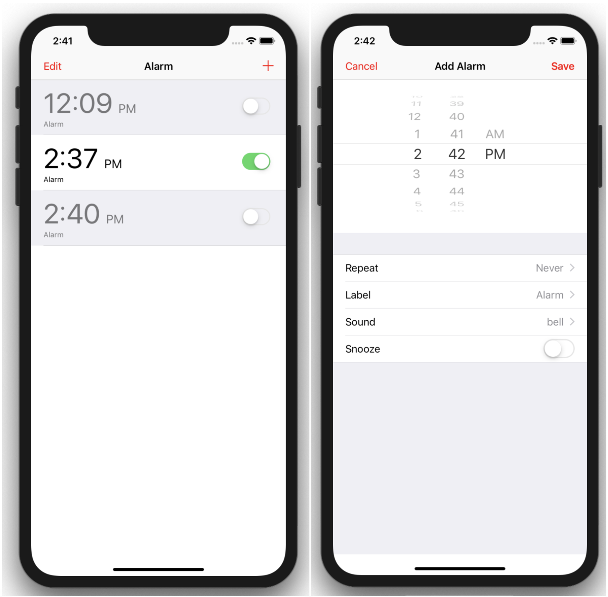
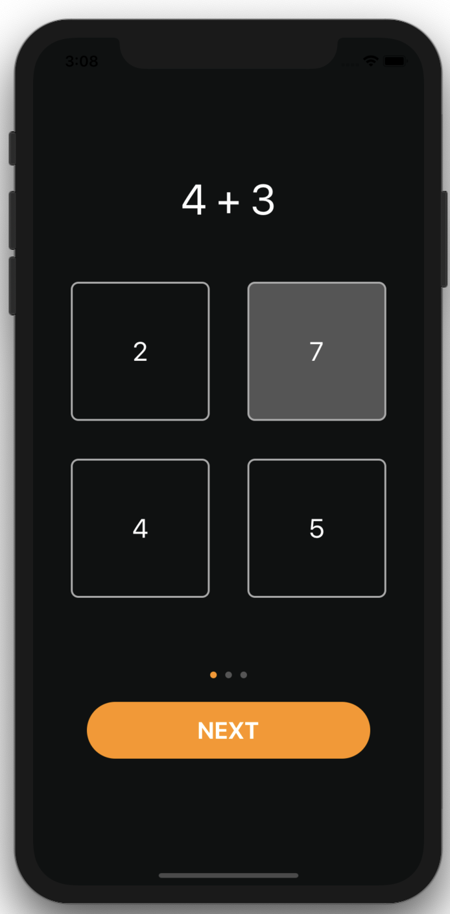

# AlarmClockEE
Mike's alarm

Get Woke! never sleep late again. iOS app for the smart alarm.

## Familiar UI / UX

## Questions to tuen off the alarm

## Specs
- Familiar UI / UX from iPhone's native alart to set alarm
- Randomely generate three mathmatical questions when alarm is activated
- After three successful answers, turn off the smart alarm via Bluetooth
- Smooth animation / transition
